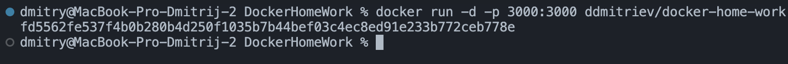
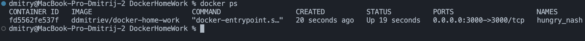
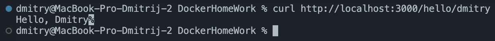

### Код проекта

> Dockerfile

```dockerfile
# Базовый образ
FROM node:alpine
# Рабочая директория
WORKDIR /app
# Копируем файл в рабочую директория
COPY package.json .
# Устанавливаем зависимости
RUN npm install
# Копируем файл в рабочую директория
COPY server.js .
# Порт на котором слушает сервер в контейнере
EXPOSE 3000
# Команда для запуска
CMD ["npm","start"]
```

> package.json

```json
{
  "name": "home-work",
  "private": true,
  "scripts": {
    "start": "node server.js"
  },
  "dependencies": {
    "express": "latest"
  },
  "author": "DDmitriev",
  "license": "MIT"
}
```

> server.js

```js
const express = require("express");
const app = express();
const port = 3000;

app.get("/hello/:user", (req, res) => {
  const user = req.params.user || "unknown";
  res.send(`Hello, ${user.charAt(0).toUpperCase()}${user.slice(1)}`);
});

const server = app.listen(port, () => {
  console.log(`Web application is listening on port ${port}`);
});

process.on("SIGINT", end);
process.on("SIGTERM", end);

function end(signal) {
  console.log(`${signal} signal received: closing HTTP server`);
  server.close(() => {
    console.log("HTTP server closed");
  });
  server.closeAllConnections();
}
```

### Сборка

```bash
docker build -t ddmitriev/docker-home-work .
```

### Запуск

```bash
docker run -d -p 3000:3000 ddmitriev/docker-home-work
```

> Результат:
> 

### Список запущенных контейнеров

```bash
docker ps
```

> Результат:
> 

### Запрос к сервису

```bash
curl http://localhost:3000/hello/dmitry
```

> Результат:
> 
